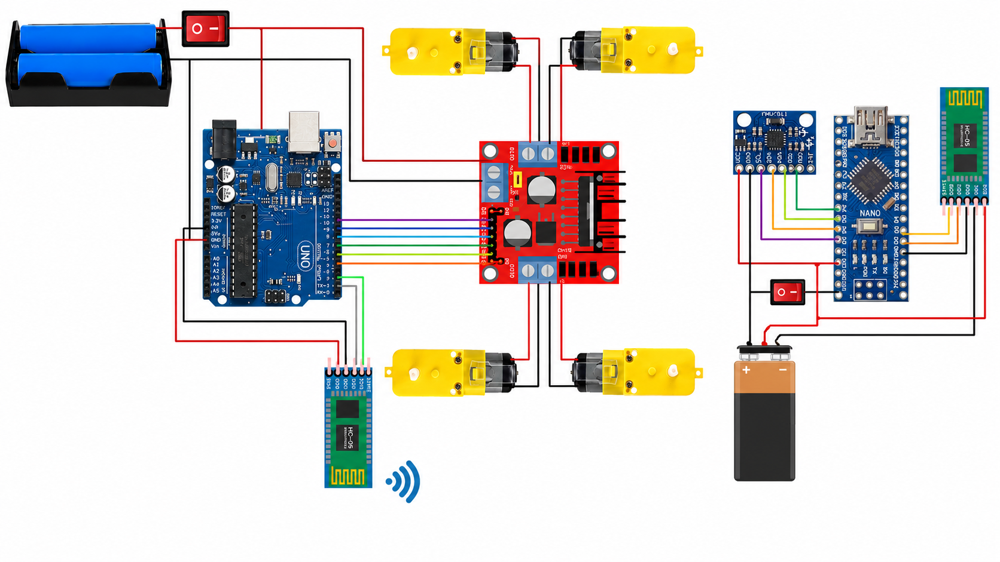

# Ishaan's Gesture Controled Robot
My project is a gesture-controlled robot that moves based on hand motions detected by sensors. Building it taught me how to combine hardware and programming to create a system that responds in real time, while overcoming challenges such as gesture accuracy and reliable communication between components. This project helped me develop valuable problem-solving and engineering skills while demonstrating how gesture-based control can be used in robotics.

| **Engineer** | **School** | **Area of Interest** | **Grade** |
|:--:|:--:|:--:|:--:|
| Ishaan T | Ridge High School | Electrical Engineering | Incoming Sophmore

**Replace the BlueStamp logo below with an image of yourself and your completed project. Follow the guide [here](https://tomcam.github.io/least-github-pages/adding-images-github-pages-site.html) if you need help.**


  
# Final Milestone

<iframe width="560" height="315" src="https://www.youtube.com/embed/PHo7yt9W1Tw?si=OvUMEo_L__PZ97P_" title="YouTube video player" frameborder="0" allow="accelerometer; autoplay; clipboard-write; encrypted-media; gyroscope; picture-in-picture; web-share" referrerpolicy="strict-origin-when-cross-origin" allowfullscreen></iframe>

- accomplishments:
    - I got my unltrasonic sensor to work
 
    
- Biggest challenges and triumphs:
    - Making sure I didn't break the code that I already had saved for the car
 
    
- Key topics I learned about:
    - I learned how to disturibue power from an Arduino Uno using a breadboard to power things such as a bluetooth module and a ultrasonic sensor

      
- What's next:
    - I am going to add a hand-tilt feature where the more you tilt your hand, the faster the car will move


# Second Milestone

<iframe width="560" height="315" src="https://www.youtube.com/embed/Dto1lnWAD3U?si=MEK0Lbv7vpBu3uVM" title="YouTube video player" frameborder="0" allow="accelerometer; autoplay; clipboard-write; encrypted-media; gyroscope; picture-in-picture; web-share" referrerpolicy="strict-origin-when-cross-origin" allowfullscreen></iframe>

- Accomplishments:
    - I car is fully able to move now
    - I made the bluetooth modules properly pair with eachother
    - I debugged my code to finally work properly
    
- Biggest challenges and triumphs:
    - Getting the bluetooth modules to work with eachother
    - Having defected motors and buying new ones
    - Fixing all my wiring so that the code could work properly
    
- Key topics I learned about:
    - I leared how hard it is to pair bluetooth modules
    - I learned that very small changes in your code can make a very big difference to your project
    - Trial and error
      
- What's next:
    - I will add an ultrasonic sensor so that the car can detect a wall in from of it and stop a couple of inches brfore crashing
  
# First Milestone

<iframe width="560" height="315" src="https://www.youtube.com/embed/5-d-ot6u49A?si=g1570QR0dAFFFP-G" title="YouTube video player" frameborder="0" allow="accelerometer; autoplay; clipboard-write; encrypted-media; gyroscope; picture-in-picture; web-share" referrerpolicy="strict-origin-when-cross-origin" allowfullscreen></iframe>

- Accomplishments:
    - I finished the overall build of my car and glove
    - I finsihed the circuitry for the car and glove
    
- Biggest challenges and triumphs:
    - Learning how to wire the circuits properley
    - Understanding what each part of the project does
    - Putting parts in the wrong location
    
- Key topics I learned about:
    - I learned how circuits work and how to wire them
    - I learn how arduinos work and what they do
    - I learned how to think like an engineer and overcome the challenges I faced
      
- What's next:
    - I will learn how to code for the gesture controls
    - I will learn how the bluetooth modules talk to eachother
    - I will learn how to debug code that doesn't work properly

# Code

This is the code for my car:
```c++
#include <SoftwareSerial.h>

// Create a virtual serial port called BT_Serial
// Pin 2 is RX (connect Bluetooth TX here)
// Pin 3 is TX (connect Bluetooth RX here)
SoftwareSerial BT_Serial(2, 3); 

// --- Pins for the Ultrasonic Sensor ---
const int TRIG_PIN = 12;
const int ECHO_PIN = 13; 

// --- Motor driver pin definitions (Double check your physical wiring matches these!) ---
#define enA 11  // Speed control Right (Change to 10 if using your other layout)
#define in1 10  // Direction Right     (Change to 9 if using your other layout)
#define in2 9   // Direction Right     (Change to 8 if using your other layout)
#define in3 8   // Direction Left      (Change to 7 if using your other layout)
#define in4 7   // Direction Left      (Change to 6 if using your other layout)
#define enB 6   // Speed control Left  (Change to 5 if using your other layout)

char bt_data;   
int Speed = 150; 
long duration;
int distance;

void setup() { 
  Serial.begin(115200);     // USB serial monitor for debugging on your Mac
  BT_Serial.begin(9600);    // FIXED: Changed to 9600 to match your Glove Transmitter!

  // Set up ultrasonic pins
  pinMode(TRIG_PIN, OUTPUT);
  pinMode(ECHO_PIN, INPUT);

  // Set up motor driver pins
  pinMode(enA, OUTPUT); 
  pinMode(in1, OUTPUT); 
  pinMode(in2, OUTPUT); 
  pinMode(in3, OUTPUT); 
  pinMode(in4, OUTPUT); 
  pinMode(enB, OUTPUT); 

  delay(200);
}

void loop() {
  // 1. Measure distance using the Ultrasonic Sensor
  digitalWrite(TRIG_PIN, LOW);
  delayMicroseconds(2);
  digitalWrite(TRIG_PIN, HIGH);
  delayMicroseconds(10);
  digitalWrite(TRIG_PIN, LOW);
  
  duration = pulseIn(ECHO_PIN, HIGH);
  distance = duration * 0.034 / 2; // Convert to cm

  // 2. Read from the Bluetooth serial port
  if (BT_Serial.available() > 0) { 
    bt_data = BT_Serial.read();
    Serial.print("Received: ");
    Serial.println(bt_data); // Prints to your Mac's Serial Monitor so you can see the gestures arriving
  }

  // 3. Safety Check: If an object is closer than 10cm, OVERRIDE and Stop!
  if (distance > 0 && distance <= 10) { 
    Stop(); 
    if (bt_data == 'f') {
      bt_data = 's'; // Block forward movement if a wall is detected
    }
  }

  // 4. Run movement blocks based on received gesture commands
  if (bt_data == 'f') {         // go forward
    forword(); 
    Speed = 180;
  } 
  else if (bt_data == 'b') {    // Reverse
    backword(); 
    Speed = 180;
  } 
  else if (bt_data == 'l') {    // turn left
    turnLeft(); 
    Speed = 250;
  } 
  else if (bt_data == 'r') {    // turn right
    turnRight(); 
    Speed = 250;
  } 
  else if (bt_data == 's') {    // Stop
    Stop(); 
  }

  // Apply speed values to motors
  analogWrite(enA, Speed); 
  analogWrite(enB, Speed); 

  delay(50);
}

// --- Motor Control Functions ---
void forword() {
  digitalWrite(in1, HIGH);
  digitalWrite(in2, LOW);
  digitalWrite(in3, LOW);
  digitalWrite(in4, HIGH);
}

void backword() {
  digitalWrite(in1, LOW);
  digitalWrite(in2, HIGH);
  digitalWrite(in3, HIGH);
  digitalWrite(in4, LOW);
}

void turnRight() {
  digitalWrite(in1, LOW);
  digitalWrite(in2, HIGH);
  digitalWrite(in3, LOW);
  digitalWrite(in4, HIGH);
}

void turnLeft() {
  digitalWrite(in1, HIGH);
  digitalWrite(in2, LOW);
  digitalWrite(in3, HIGH);
  digitalWrite(in4, LOW);
}

void Stop() {
  digitalWrite(in1, LOW);
  digitalWrite(in2, LOW);
  digitalWrite(in3, LOW);
  digitalWrite(in4, LOW);
}
```

This is the code for my gesture controller:
```c++
#include <Wire.h> // I2C communication library

// Renamed to MPU_ADDR to avoid conflict with the ARM chip's internal Memory Protection Unit definition
const int MPU_ADDR = 0x68; 
int16_t AcX, AcY, AcZ;

int flag = 0;

void setup() {
  Serial.begin(9600);   // USB Serial Monitor (for debugging on your computer)
  Serial1.begin(38400);    // Hardware Serial for Bluetooth (Pins RX/0 and TX/1)

  // Initialize interface to the MPU6050
  Wire.begin();
  Wire.beginTransmission(MPU_ADDR);
  Wire.write(0x6B);
  Wire.write(0);
  Wire.endTransmission(true);

  delay(500);
}

void loop() {
  Read_accelerometer(); // Read MPU6050 accelerometer

  // Send commands over Bluetooth using Serial1
  if (AcY > 60 && flag == 0) {
    flag = 1; 
    Serial1.write('f');
    Serial.println("f");
  }
  if (AcY < 50 && flag == 0) {
    flag = 1; 
    Serial1.write('b');
    Serial.println("b");
  }

  if (AcX > 50 && flag == 0) {
    flag = 1; 
    Serial1.write('l');
    Serial.println("l");
  }
  if (AcX < -50 && flag == 0) {
    flag = 1; 
    Serial1.write('r');
    Serial.println("r");
  }

  if ((AcX < 50) && (AcX > -50) && (AcY > -50) && (AcY < 60) && (flag == 1)) {
    flag = 0;
    Serial1.write('s');
    Serial.println("s");
  }

  delay(100);
}

void Read_accelerometer() {

  if (IMU.accelerationAvailable()) {

    IMU.readAcceleration(x, y, z);

  }
}
```

# Schematics



# Bill of Materials
Here's where you'll list the parts in your project. To add more rows, just copy and paste the example rows below.
Don't forget to place the link of where to buy each component inside the quotation marks in the corresponding row after href =. Follow the guide [here]([url](https://www.markdownguide.org/extended-syntax/)) to learn how to customize this to your project needs. 

| **Part** | **Note** | **Price** | **Link** |
|:--:|:--:|:--:|:--:|
| Velcro Strps | This is used to easily attach things together througout the build | $3.99 | <a href="[https://www.amazon.com/Arduino-A000066-ARDUINO-UNO-R3/dp/B008GRTSV6](https://www.amazon.com/Art3d-Sticky-Double-Sided-Command-Adhesive/dp/B0B58FGF8H/ref=sr_1_1_sspa?crid=2N0JOMEZLJ2DS&dib=eyJ2IjoiMSJ9.qGUGB_MXfmbL0MW7bqNJbxvZC9pzliDJ9KYyRNNrctnh03kCcUXONRrcPYdGeo7Jwzrm83HyF8Jsb1RkcdlLPAw-8RkxbTCMiW6UI1Fpnjv9GjXUg9VBOLxmLVUbmMp5J7gFXKKLTWQ-w_L4Q9rykEUqKmjv-v6GRykMMZLY2cVt__lLxMIlwr6qBnQLWpHiklifUJwjiURxO--TTt2VReYgmN0z7118ifSucrkvRrg.mwA0L4zMSlJP2RO8IBba7dVqwa1Lkr8KvY1JmeQEfCg&dib_tag=se&keywords=velcro+tape+pieces&qid=1716734034&sprefix=velcro+tape+piece%2Caps%2C89&sr=8-1-spons&sp_csd=d2lkZ2V0TmFtZT1zcF9hdGY&psc=1)/"> Link </a> |
| Arduino Uno Clone | This is a microcontrolling board that acts as the brain for the car  | $14.99 | <a href="https://www.amazon.com/ELEGOO-Board-ATmega328P-ATMEGA16U2-Compliant/dp/B01EWOE0UU/ref=sr_1_2_sspa?crid=3A6NCD2X9JEMJ&dib=eyJ2IjoiMSJ9.AcWZy-Yg4mDTnhzEHozxzPZdVC5-KUL2tW-OQewDKpBB4brSpD p4bn74WcXiW3KarYertgpNaLJ0VHKx0qsPqolKAhiz1GRG5BwJQl73cEvrlXIXNmqlpSvU7uu2aRVSwAZi9Gj2AjSPLM3esW1Gzy9xEiQ9oiR5LCNjh4MlYDx5mTm5sI4rsD4CFTipJnF572qXlickl35FRcCj8oMXQotumgqI4yEIq0HobOtIlEnNhtVB51JMBHhqtmmF_PC9WeHJ4ySUVVcv_gq3_VeG1aAEbdm4NXmmT6NOYPw4Qo.1PFdgFT22oqO5Mg6-6j_aUL_EV8tUPuaFrB5N9oaEX0&dib_tag=se&keywords=elegoo+arduino&qid=1716856465&s=electronics&sprefix=elegoo+arduino%2Celectronics%2C99&sr=1-2-spons&sp_csd=d2lkZ2V0TmFtZT1zcF9hdGY&psc=1/"> Link </a> |
| Arduino Nano 33 BLE Sense | What the item is used for | $29.78 | <a href="[https://www.amazon.com/Arduino-A000066-ARDUINO-UNO-R3/dp/B008GRTSV6](https://www.amazon.com/Arduino-Nano-Sense-headers-ABX00070/dp/B0BQHZ88WD/ref=sr_1_4?crid=1BTYPUQCTIWYN&dib=eyJ2IjoiMSJ9.5ykyUyT10Vdnbme1Ur85NoPh9YmzeyxQKWTP0jF0ju7Zw9b2hLtWjY3pTyREGe5HkneZz75CgR3J9S8HJbMwmvkj1c1Mu9x0rZ651S1aBHwNqxIYbKjWG8yzYzDh5tcKP57E9RxRmqavQMCJ-QtCLIFas8oQKdBZDx67b_JUYJ3hdfDjHDXrimHAEzVTZrVAwh6NOXZ8-yMZIcp72LVtDsuQxyCvkrDyZM1EbuZQHlc.iy6QHwMR4-UrQZrInFc0eTSZJP6LewrRVqwpOfrQCG0&dib_tag=se&keywords=arduino+nano+33+ble&qid=1748096993&sprefix=arduino+nano+33ble%2Caps%2C151&sr=8-4)/"> Link </a> |
| Car Chassis Kit | This is the kit with all the parts for the car structure | $37.99 | <a href="https://www.amazon.com/dp/B0DJ7BT1V5?ref=cm_sw_r_cso_cp_apin_dp_RCSYWRX92M0H5DJ6HNQA&ref_=cm_sw_r_cso_cp_apin_dp_RCSYWRX92M0H5DJ6HNQA&social_share=cm_sw_r_cso_cp_apin_dp_RCSYWRX92M0H5DJ6HNQA&rsd=oU5zjHTwUjufNpZkC6CW0sqRlEipy6Xgf59f5777Kxh7cknbp6DwTNVEgVR1R1%2FY0I8OXRT9EOeWKVF0ff4yEbtnF%2Fc9MNo6yf5KfYW6Lx%2BkqE4%3D&edk=AQIDAHi1lw%2FM8UbbSMD9ScOOFEmBMHMthHeEhqDaQYPJUAX3jQHYb0B2nFfwd4jzBFZyiYMUAAAAfjB8BgkqhkiG9w0BBwagbzBtAgEAMGgGCSqGSIb3DQEHATAeBglghkgBZQMEAS4wEQQM7ULhz148q%2B1PjBJVAgEQgDvE8maRGRFUIB7tnUdXxocbXxxr5gXUvho7mquZi7Zok3ViYk7wwVFTYIEajFhVByN74efn2RX1qaf%2BHQ%3D%3D/"> Link </a> |
| Screwdriver Kit | This came with a screwdriver with changable tips for varsitity | $7.19 | <a href="https://www.amazon.com/Small-Screwdriver-Set-Mini-Magnetic/dp/B08RYXKJW9//"> Link </a> |
| Electronics Kit | This had jumperwires and other electronic components that I needed for the breadboarding | $14.99 | <a href="[https://www.amazon.com/Arduino-A000066-ARDUINO-UNO-R3/dp/B008GRTSV6](https://www.amazon.com/Smraza-Electronics-Potentiometer-tie-Points-Breadboard/dp/B0B62RL725/ref=sxts_b2b_sx_reorder_acb_business?content-id=amzn1.sym.f63a3b0b-3a29-4a8e-8430-073528fe007f%3Aamzn1.sym.f63a3b0b-3a29-4a8e-8430-073528fe007f&crid=2IC3T44H3U3WG&cv_ct_cx=breadboard+kit&dib=eyJ2IjoiMSJ9.TUd5tu2T8rmms7ZuJ0UzmbtpLL1zsu93bQM0PzwnP4E.sT0V0vL_QtbYv8ymVTCcRkhFNgBtRvRiT7G4FT1oGTE&dib_tag=se&keywords=breadboard+kit&pd_rd_i=B0B62RL725&pd_rd_r=67e1f4ff-e3b9-44e4-b441-b4ae282f036b&pd_rd_w=UjFaP&pd_rd_wg=0xRoC&pf_rd_p=f63a3b0b-3a29-4a8e-8430-073528fe007f&pf_rd_r=BFGP77H27ZN31W4PZAW6&qid=1715911733&sbo=RZvfv%2F%2FHxDF%2BO5021pAnSA%3D%3D&sprefix=breadboard+kit%2Caps%2C109&sr=1-2-9f062ed5-8905-4cb9-ad7c-6ce62808241a)/"> Link </a> |
| Breadboard Kit | This came with 2 small breadboards and 2 big breadboards | $7.89 | <a href="https://www.amazon.com/Breadboards-Solderless-Breadboard-Distribution-Connecting/dp/B07DL13RZH/ref=sxts_b2b_sx_reorder_acb_business?content-id=amzn1.sym.f63a3b0b-3a29-4a8e-8430-073528fe007f%3Aamzn1.sym.f63a3b0b-3a29-4a8e-8430-073528fe007f&crid=1RAL6PA1TZ81Q&cv_ct_cx=breadboard+kit&dib=eyJ2IjoiMSJ9.TUd5tu2T8rmms7ZuJ0UzmbtpLL1zsu93bQM0PzwnP4E.sT0V0vL_QtbYv8ymVTCcRkhFNgBtRvRiT7G4FT1oGTE&dib_tag=se&keywords=breadboard+kit&pd_rd_i=B07DL13RZH&pd_rd_r=1e3e6f57-5578-4452-b230-90d43c79b5d3&pd_rd_w=rFN6B&pd_rd_wg=3mMuA&pf_rd_p=f63a3b0b-3a29-4a8e-8430-073528fe007f&pf_rd_r=JC9D7T4VYRDQ9HJVY5X8&qid=1715912837&s=electronics&sbo=RZvfv%2F%2FHxDF%2BO5021pAnSA%3D%3D&sprefix=breadboard+kit%2Celectronics%2C102&sr=1-1-9f062ed5-8905-4cb9-ad7c-6ce62808241a/"> Link </a> |
| Micro USB Cable | Used to connect to the arduino nano so you can code for it | $5.49 | <a href="https://www.amazon.com/Charging-Transfer-Android-Trustable-MYFON/dp/B098DW7485/ref=sr_1_6?crid=3USJU0DMSZB2S&keywords=micro+usb&qid=1686187078&s=electronics&sprefix=micro+usb%2Celectronics%2C106&sr=1-6/"> Link </a> |
| Accelerometer | Used to measures the acceleration, vibration, or movement of the car | $15.99 | <a href="https://www.amazon.com/dp/B0D2TJVMNY?ref=fed_asin_title/"> Link </a> |
| 2 HC05's | A bluetooth module that lets to objects wirelessly communicate with eachother | $19.98 | <a href="https://www.amazon.com/DSD-TECH-HC-05-Pass-through-Communication/dp/B01G9KSAF6/ref=sr_1_3?crid=2J833J7AYQJA&keywords=hc05&qid=1686187263&sprefix=hc0%2Caps%2C112&sr=8-3/"> Link </a> |
| Breadboard Power Supply | This is what gives power to the breadboard and the components used on the breadboard | $8.99 | <a href="https://www.amazon.com/ALAMSCN-Solderless-Breadboard-Battery-Arduino/dp/B08JYPMCZY/ref=sxts_b2b_sx_reorder_acb_business?content-id=amzn1.sym.f63a3b0b-3a29-4a8e-8430-073528fe007f%3Aamzn1.sym.f63a3b0b-3a29-4a8e-8430-073528fe007f&crid=Z2S8NZU0KN1S&cv_ct_cx=breadboard+power+supply&dib=eyJ2IjoiMSJ9.nJ_euybTOUu9E6yyDpnEqg.NgztCYPGkG96eXyyFxpvxOVw5ykdTUq6oziUQnvf51E&dib_tag=se&keywords=breadboard+power+supply&pd_rd_i=B08JYPMCZY&pd_rd_r=f2beb6df-6d77-44a3-8b72-83255f19ca20&pd_rd_w=r1wmq&pd_rd_wg=ToFNq&pf_rd_p=f63a3b0b-3a29-4a8e-8430-073528fe007f&pf_rd_r=R5ZMMGW4CXRBP3PWAYMA&qid=1715912515&s=electronics&sbo=RZvfv%2F%2FHxDF%2BO5021pAnSA%3D%3D&sprefix=breadboard+power+s%2Celectronics%2C114&sr=1-1-9f062ed5-8905-4cb9-ad7c-6ce62808241a/"> Link </a> |
| 9V Batteries | Gives the main power to the compenents in the car and the glove | $12.69 | <a href="https://www.amazon.com/Amazon-Basics-Performance-All-Purpose-Batteries/dp/B00MH4QM1S/ref=sr_1_5_pp?crid=3TQ7ANPH958JM&dib=eyJ2IjoiMSJ9.bmcV2Upj_vpB6G9CFlPPxYAryat512da7ekZjc52HecXSTmtx7PbJ50EgQFPCMqlAxjOUq-tL4vQTpozlHvH89bMwx-HJoyGcdz6EY8HrMxahTiqOXkoP7ewkDcgHoMhmHamdlQfW6FBHO0Gm-DYZZnnMuvEU3qOpemA8PGEvRhEx4-lGaBZhrvls039G1-9SizAW-YRGXZ2fFrdVDlREyyOhAuxXZaE5QqUxWesRQgP9UfGOYaInRWTTPwhDbXFa-RPzGbU1C_u4wq-NMqKBtWEQqR9-cA8O3FYOx3icEY.dtKJmI2T-iCmMM_bYnbiHUWzhKpJDRxS-bBmZIwYFKM&dib_tag=se&keywords=9v+batteries&qid=1720651326&rdc=1&s=electronics&sprefix=9v+batteries%2Celectronics%2C105&sr=1-5/"> Link </a> |
| DMM | Used to mesure and varify circuit parameters | $9.98 | <a href="https://www.amazon.com/dp/B0CXM242J1?ref=fed_asin_title&th=1/"> Link </a> |
| Ultrasonic Sensor | Used for mesurements, obstacle detection, and liquid level monitoring | $6.99 | <a href="https://www.amazon.com/WWZMDiB-HC-SR04-Ultrasonic-Distance-Measuring/dp/B0B1MJJLJP/ref=sr_1_1_sspa?crid=3MO9GT3J1FU7J&dib=eyJ2IjoiMSJ9.w-v74CMMP9eRh1BFF5BJ6xZlNH9LlX5HLX1Axp43FWYbpT_9h64LVT_hJcnFuLLU36s_1nGWoajK4N7MDmpkDbJya3W8HYQJjYuN0slE0oCFqnfqycHTLM9hS6ALXGj8tnxnT3ju2cWFCx2h9D8tg5laj_ylnlZFiUwjFPrj1v4ZG6YOVFhzaLdcM5p85xEjTRKVhfqNWEnIji-DkX9b7nU2Vtw6cH-dTi7RIQ5jyYw.3GvxOSggudERYbFqcc2sYhNSP2sx7LpCCukUyINGa70&dib_tag=se&keywords=ultrasonic%2Bsensor&qid=1784299116&sprefix=ultrasonic%2Bsenso%2Caps%2C142&sr=8-1-spons&sp_csd=d2lkZ2V0TmFtZT1zcF9hdGY&th=1"> Link </a> |

# Resources/Citations
- [Source 1](https://www.amazon.com/ref=nav_logo)
- [Source 2](https://chatgpt.com/)
- [Source 3](https://gemini.google.com/app)
- [Source 4](https://www.hackster.io/embeddedlab786/hand-gesture-control-robot-via-bluetooth-94b13d)
- [Source 5](https://www.youtube.com/watch?v=BXXAcFOTnBo)
- [Source 6](https://www.youtube.com/watch?v=KGwtit2bFyo&t=13s)

